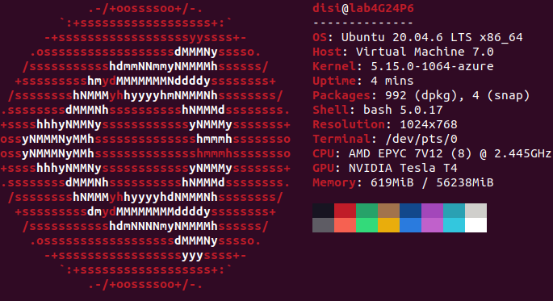

# readme

### Table of Contents

- <a href='#requirements'>Requirements</a>
- <a href='#folders'>Folders</a>
- <a href='#datasets'>Datasets</a>
- <a href='#training L-Net'>Training</a>
- <a href='#evaluation'>Evaluation</a>
- <a href='#model'>Model</a>
- <a href='#reference'>Reference</a>

## Installation

This project has been tested on an azure machine running ubuntu.

Create a folder (I suggest you to call it "ml" to avoid editing more paths), navigate inside it and clone the repository. Create a virtual environment, activate it, then run `pip install -r requirements.txt `

Note that you should also have an nvidia gpu and cuda drivers installed, otherwhise the models will be loaded in cpu and will be much slower and prone to crashes.

## Structure

The starting configuration will look something like this:

- virtualenvironment
- intromlproject
  - requirements.txt
  
  - data_setupper.ipynb (notebook used to download and prepare data)
  
  - training-main.py (python script that trains and validates the chosen model)
  
  - testing-main.py (python script that tests the provided model)
  
  utils
  
  - data_aug_utils.py   (file containing the data augmentation functions)
  - download_utils.py   (file containing the download functions)
  - init_checkpoints.py (file containing the function for the checkpoints)
  - init_models.py      (file containing the models)
  - optimizer.py        (file containing functions for the optimizer fixed/custom)
  - read_dataset.py     (file containing the function to read the dataset)
  - trainloop.py        (file containing the training/validation/testing loop)
  - epochs_loop.py      (file containing the epochs loop)
  
  
  
  - main.py     (main file to run the training/testing loop)
  - prepare_folders.py   (file to download the dataset and create the train, test and validation folders)

## How is the data organized?

main folder -> train,test,val -> classes -> images

## Instructions

Navigate inside the repository, then you can use the `data_setupper.ipynb` notebook to download any dataset of your choosing. We decided to use a notebook instead of a .py file is because the datasets we tried came from different sources (kaggle, torch, generic websites) and we wanted to have the flexibility to just download them and store them inside a datasets folder, which will be automatically created during your first download. All you have to do is follow the comments `@edit` and edit accordingly to your computers paths. If you called the parent folder "ml", then some paths are already correct. More information is available inside the notebook. If you followed the procedure correctly you will have the following configuration:

Where only the name of the specific dataset and the name of the folders containing the images will differ based on what you downloaded.

- Prepare_folders.py is a file where you can find download functions, either for kaggle (remember to have your kaggle.json file located in folder etc) or from a direct download link. We are also creating the train-validation-test folders, and creaitng augmented images. Prima trasformi e poi generi o prima generi e poi trasformi?
- main.py is the main file where you will need to define the main folder of the dataset you will use this repoository on. You can find the list inside the main.py file (add the exact lines). There is also a list of models we tried, pick the one you desire and set it as model_name. Define the trasformation and its parameters, note that each model has a preferred image size, you can find the optimal image size per model in the init_models.py file. After that, you can choose all hyperparameters and other parameters (ca capire come chiamarli). After this, you can execute the main.py which will initialize the training loop.
- ? come facciamo a caricare dei pesi?
- come facciamo a runnare il test loop?
- da dove faccio partire i check point?
- aggiustare validation e train loop per implementare i checkpoints e scegliere se usare o meno il validation loop durante la fase di traianing 
- aggiustare la funzione criterion
- modificare i checkpoint per salvare la migliore epoca (paragonare train-val loss alla precedente)
- docstring per le varie funzioni
- per i transformer, c'è il dsicrimantor, serve un loop diverso?

## Reference