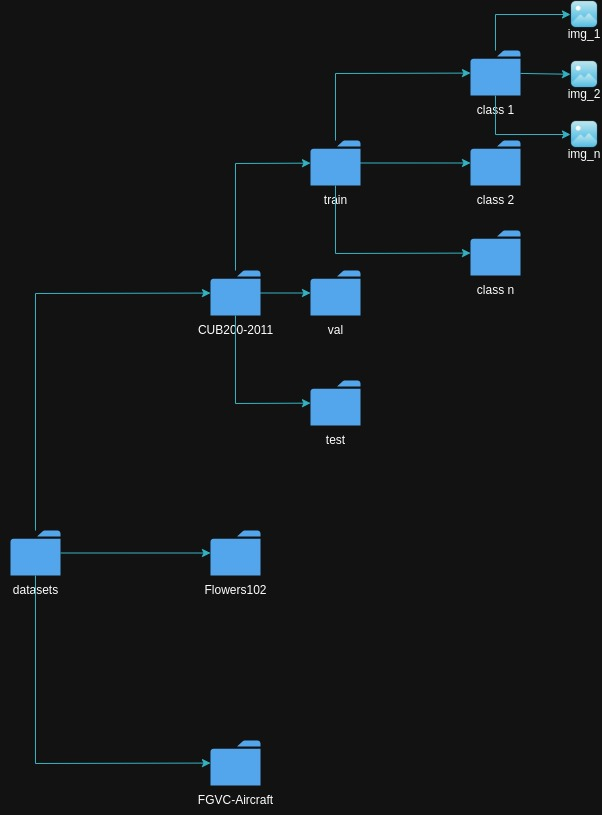

# readme

### Table of Contents

- <a href='#requirements'>Requirements</a>
- <a href='#folders'>Folders</a>
- <a href='#datasets'>Datasets</a>
- <a href='#training L-Net'>Training</a>
- <a href='#evaluation'>Evaluation</a>
- <a href='#model'>Model</a>
- <a href='#reference'>Reference</a>

## Installation

This project has been tested on an azure machine running ubuntu.

Create a folder (I suggest you to call it "ml" to avoid editing more paths), navigate inside it and clone the repository. Create a virtual environment, activate it, then run `pip install -r requirements.txt `

Note that you should also have an nvidia gpu and cuda drivers installed, otherwhise the models will be loaded in cpu and will be much slower and prone to crashes.

## Structure

The starting configuration will look something like this:

- virtualenvironment

- intromlproject
  
  - requirements.txt
  
  - data_setupper.ipynb $\to$ notebook used to download and prepare data
  
  - training-main.py $\to$ python script that trains and validates the chosen model
  
  - testing-main.py $\to$ python script that tests the provided model.
  
  - testing-main-exam.py $\to$ python script that tests a model and 
  
  - utils/
    
    - augmentation.py $\to$ contains functions for data augmentation.
    
    - custom_models.py $\to$ contains functions to built models from scratch.
    
    - downloader.py $\to$ contains functions to download data from different sources.
    
    - extractors.py $\to$ contains functions to extract different archived files
    
    - logger.py $\to$ contains a function which initializes the logger.
    
    - models_init.py $\to$ contains functions to initialize models from already existing libraries.
    
    - optimizers.py $\to$ contains a function to implement a custom optimizer. #todo
    
    - testing.py $\to$ contains the function to test a model and send files to the competition server.
    
    - training.py $\to$ contains the functions to train and validate the model for a single epoch. 
    
    - testing.py $\to$ contains the function to test a model storing the predictions in a dictionary and submits it to a server.

## Usage

#### Dataset preparation

Navigate inside the repository, then you can use the `data_setupper.ipynb` notebook to download any dataset of your choosing. We decided to use a notebook instead of a .py file because the datasets we tried came from different sources (kaggle, torch, generic websites) and we wanted to have the flexibility to just download them and store them inside a datasets folder, which will be automatically created during your first download. 

All you have to do is follow the comments `@edit` and edit accordingly to your computers paths. If you called the parent folder "ml", then some paths are already correct. More information is available inside the notebook. If you followed the procedure correctly you will have the following datasets configuration:

Only the name of the specific dataset and the name of the folders containing the images will differ based on what you downloaded.

#### Model training

You can check the `model_initializers` dictionary inside the `init_model` function in the `models_init.py` to see all the models implemented, copy and paste the name of the model you want to use, then open the `training-main.py` to set the training up.

Paste in the variable `model_name` what you just copied, then edit the variables `root`, `img_folder` accordingly to your specific system path. Referring to the graph above, `img_folder` should be named as `CUB200-2011` or `Flowers102` etc, lastly `root` should be the system path up until the folder I suggested to you to call `ml`, which is the folder that contains the virtual environment, the datasets and the repository.

After this, edit the files inside the config however you desire, the f-strings will allow for a smoother experience automatically constructing the correct paths for everything that will be tracked during the training.

Once you have set the training up, you can just run the file from the terminal (remember to have the virtual environment activated).

#### Model testing

The file is extremely similar to the training one, just make sure to choose the correct path to your .pth file.

## Reference